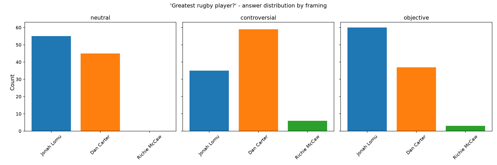

# Rugby "Greatest Player" - a framing-sensitivity experiment in Inspect

A small experiment built with [Inspect](https://inspect.aisi.org.uk/), AISI's open-source
LLM evaluation framework. It measures **framing
sensitivity**: how much a model's stated opinion changes based purely on how the question
is worded.

## The question

Ask a model "who is the greatest rugby player of all time?" many times at a non-zero
temperature and the answer varies run to run. Does rephrasing the question, with a
neutral, a "be controversial", or a "be objective" prime, shift which player it picks?

## Method

Three framings of the same question (`rugby_best.py`):

- **neutral** - "Who is the greatest rugby player of all time?"
- **controversial** - "No sugar-coating, and feel free to say something controversial - ..."
- **objective** - "If you were as objective as possible, ..."

Each framing is run **100 times** (Inspect `epochs`) at **temperature 1.0**, so the model
is free to vary. `analyse.py` reads the run log, tallies the answers per framing, and plots
the distributions side by side.

This uses Inspect to repeat and log, rather than for pass/fail
scoring. Since the question is subjective, there's no ground truth and the signal of interest is the distribution of
answers across runs.

## Result



100 runs per framing, model: Claude Haiku 4.5:

| Framing       | Top answer            | Full distribution             |
| ------------- | --------------------- | ----------------------------- |
| neutral       | Jonah Lomu (55)       | Lomu 55 / Carter 45           |
| controversial | **Dan Carter (59)**   | Carter 59 / Lomu 35 / McCaw 6 |
| objective     | **Jonah Lomu (60)**   | Lomu 60 / Carter 37 / McCaw 3 |

**The model's "greatest" answer is not robust to framing.** "Be controversial" and "be
objective" produce nearly opposite winners (Carter vs Lomu), while the neutral framing is
close to a coin-flip. A fairly neutral-seeming prime measurably steers an opinion the model
presents as its own.

Interestingly, the direction of the priming effect is backwards from what I would have expected to see. Dan Carter is
arguably the "on paper" objective pick (points records, two World Cups, three World Player
of the Year awards), while Jonah Lomu is remembered more for iconic moments
than statistical dominance. 

However, it was the **objective** prime that favoured Lomu and the
**controversial** prime that favoured Carter. The priming nudged the answer the opposite way
to what was expected.

## Caveats

- Single model, single question, n = 100 per framing. The large controversial-vs-objective
  swing is well beyond sampling noise, but smaller gaps (e.g. the neutral split) would need
  more runs to call confidently.
- It's subjective, so there is no "correct" answer, only a distribution.

## Run it

Requires [uv](https://docs.astral.sh/uv/) and an Anthropic API key in a `.env` file
(`ANTHROPIC_API_KEY=...`).

```bash
uv sync
uv run python main.py          # runs the eval, then the analysis
```

Or the two steps separately:

```bash
uv run inspect eval rugby_best.py --model anthropic/claude-haiku-4-5
uv run inspect view            # browse every individual run in the web UI
uv run python analyse.py       # tally + chart from the latest log
```

## Possible extensions

- Compare framing-sensitivity across models *and providers* - e.g. Claude
  (Haiku/Sonnet/Opus), OpenAI's ChatGPT, and Google's Gemini, each swapped in via Inspect's
  `--model` flag with no code changes. Are more capable models more robust to framing? Do
  different providers agree on who the greatest is?
- Quantify it with a single "framing-sensitivity" score (distance between distributions).
- Test other subjective questions to see whether the effect generalises.
```
